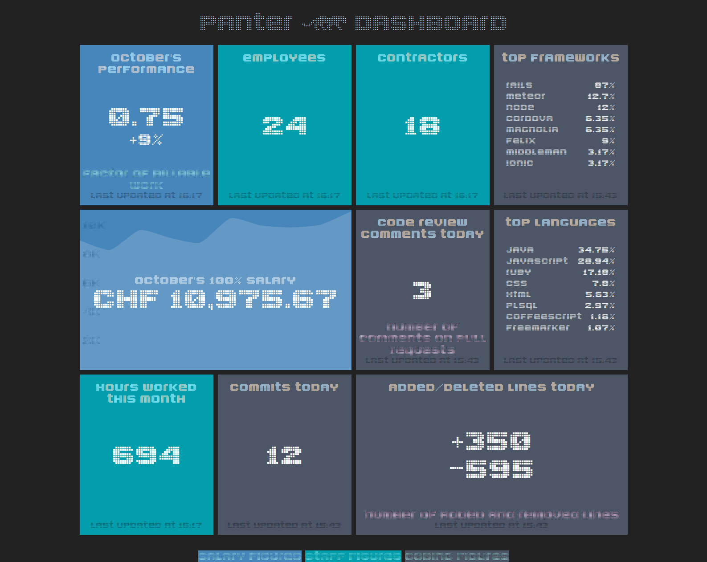

# Panter Dashboard

Built with [Dashing](https://shopify.github.io/dashing/).

## Components used

* Redis
* Panter Controllr
* Github
* Gitlab

## Setup

* Install ruby (`rbenv` recommended)
* Install redis
* `cp .env.example .env` and fill in some values (esp. the access tokens)
* `cp config/salaries.yml.sample config/salaries.yml` and fill in some values
* `bundle`
* `rake clone_git_repositories` to have all git repositories locally
  alternatively you can rsync the cloned repositories from the dashboard
  production server.
* `dashing s`

  The server will fetch all data for all modules by default. To only load
  certain modules the environment variable `MODULES` can be used.

  Example 1, only load controllr data

  `MODULES=controllr dashing s`

  Example 2, skip all data fetching altogether (useful when you already have
  data fetched previously and want to quickly start the server)

  `MODULES= dashing s`

  Example 3, fetch git and controllr data

  `MODULES=controllr,git dashing s`

## License

Licensed under the [GNU General Public License v3.0](LICENSE)
